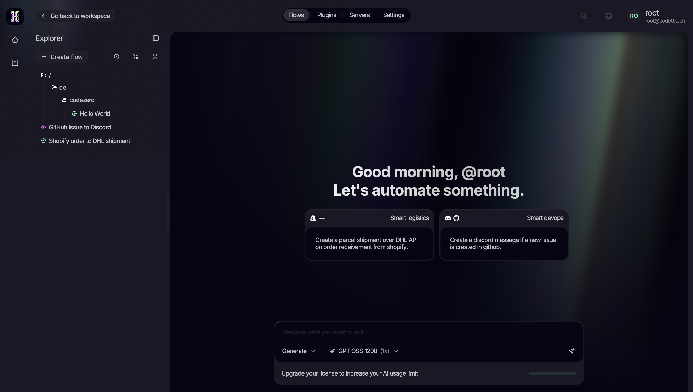
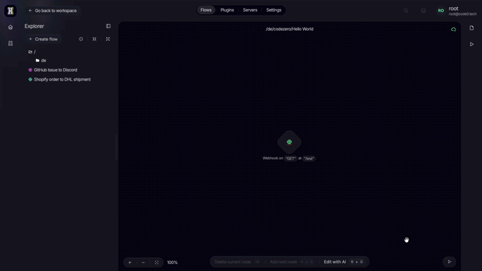
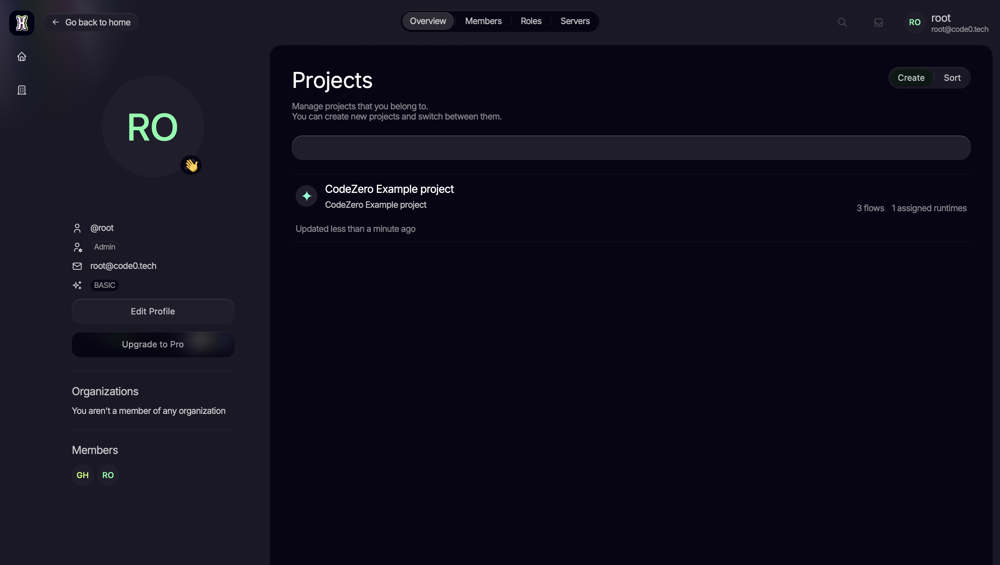
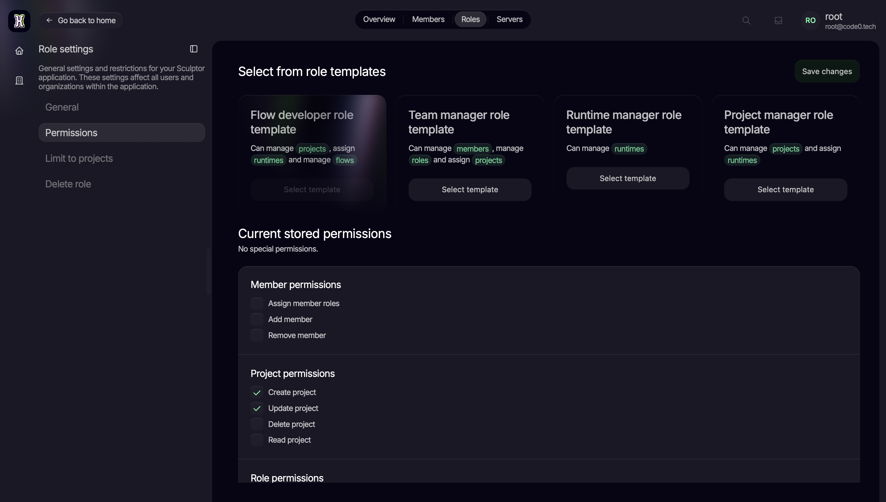

<div align="center" style="margin: 5% 20%">

<picture>
  <source media="(prefers-color-scheme: dark)" srcset="images/Codezero_Logo_White.svg">
  
</picture>

### Every great idea starts at zero. Start with CodeZero.

**The open-source platform for building automations visually. Powered by AI, running wherever you want.**

[](https://codezero.build)
[](https://docs.codezero.build)
[](https://discord.com/invite/AyMB7DtA7P)
[](https://www.youtube.com/@CodeZeroBuild)
[](https://www.instagram.com/codezero.tech/)

</div>

<hr/>

## What is CodeZero?

CodeZero lets you build **flows** on a visual canvas instead of writing boilerplate code. A flow can be an automation, an integration, or entire backend logic. Connect a trigger, chain your logic node by node, hit run. That's it.

Whether you want to glue two services together, expose your own API, or automate a whole business process: if you can sketch it, you can ship it.

## ✨ Build flows with AI

Don't start from a blank canvas. Describe what you want or pick a smart template, and CodeZero builds the flow for you.



And it doesn't stop at generation. You can refine, extend, or rewrite any part of your flow with a single prompt, right on the canvas.



Bring your own model: plug in OpenAI, OpenRouter, or any compatible provider and choose which models power your workspace.

## What can you build?

- **Integrations:** New GitHub issue? Post it to Discord. New Shopify order? Create the DHL shipment automatically.
- **Your own APIs:** Expose any flow as an HTTP endpoint and use CodeZero as a visual backend.
- **Scheduled jobs:** Run flows on a cron schedule for reports, syncs, and cleanups.
- **Business processes:** Model multi-step logic with full control over data, branching, and error handling.

## Why CodeZero?

| | |
|---|---|
| **Visual flow editor** | Build logic as a graph of nodes that stays readable, debuggable, and shareable with your team. |
| **AI-assisted building** | Generate and edit flows with natural language, directly on the canvas. |
| **Triggers built in** | HTTP/webhook and cron triggers come out of the box. Plugins add more. |
| **Your data, your infrastructure** | Fully self-hostable. Or run hybrid: IDE in the cloud, runtimes on your own hardware. Your data never leaves your network. |
| **Scales with you** | Every runtime component scales independently, from a single box to a fleet. |
| **Extensible** | Extend runtimes with plugins that add new nodes, flow types, and triggers. |
| **Built for teams** | Organizations, projects, roles, and fine-grained permissions included. |

## Made for teams, not just tinkerers

Structure your work in projects and organizations, and invite your team into a shared workspace.



Control exactly who can do what. Role templates cover the common setups, and fine-grained permissions handle everything else.



## Getting started

All you need is [Docker](https://docs.docker.com/get-docker/). This repository contains the official releases and the Docker Compose setup:

```bash
git clone https://github.com/code0-tech/codezero.git
cd codezero/docker-compose

# adjust secrets & settings (ports, AI models, ...) in .env, then:
docker compose up -d
```

Open [http://localhost](http://localhost) and log in with the initial credentials from your `.env` (default: `root@code0.tech` / `root`).

> [!TIP]
> Everything is configured through `docker-compose/.env`: which components to run (`COMPOSE_PROFILES`), TLS, ports, and the AI models available in the editor. **Change the default secrets before exposing anything publicly.**

For detailed guides, head over to the [documentation](https://docs.codezero.build).

## Community

CodeZero is open source and built in the open. Join us:

- [Discord](https://discord.com/invite/AyMB7DtA7P): ask questions, share flows, talk to the team
- [Docs](https://docs.codezero.build): guides and reference documentation
- [GitHub](https://github.com/code0-tech): all components, issues, and contributions
- [YouTube](https://www.youtube.com/@CodeZeroBuild): devlogs and product updates

Contributions are welcome, from new plugins and nodes to docs and bug reports. The [contributing guide](CONTRIBUTING.md) shows you where to start.

## License

Licensing varies per component. See the [LICENSE](LICENSE) file in this repository and in each subproject for details.

---

<div align="center">

<picture>
  <source media="(prefers-color-scheme: dark)" srcset="images/CodeZero_Icon_White.svg">
  
</picture>

*Made with ❤️ by the CodeZero community*

</div>
