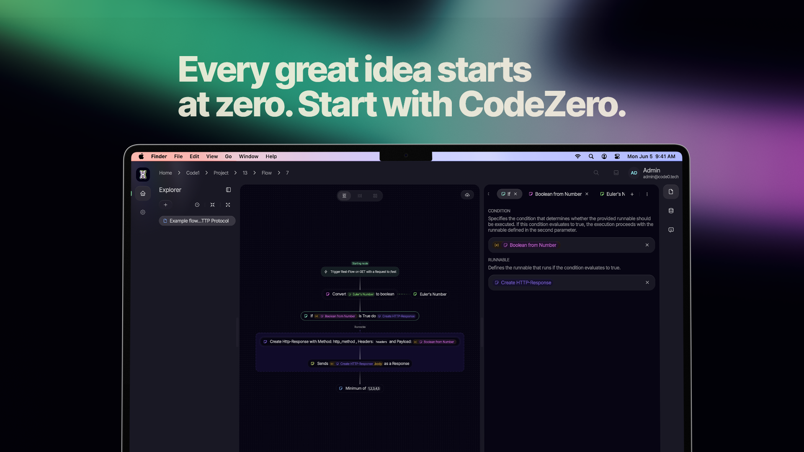

# CodeZero

## What is CodeZero?

CodeZero is an open-source platform for building, managing, and automating flows, as well as organizing projects, organizations, roles, members, and users. It enables comprehensive process automation and organizational management in a scalable, modular system.

A "flow" in CodeZero is a sequence of connected nodes, each representing a step in a process. Flows can be used to automate business logic, data processing, integrations, and more. Projects and organizations provide structure and access control, while roles and members enable fine-grained permissions and collaboration.

## Architecture & Infrastructure

- **Frontend (sculptor):** The main user interface, built with Next.js and React. Users create and manage flows, projects, organizations, and more. Sculptor communicates directly with the backend service.
- **Backend (sagittarius):** Central service for data storage, orchestration, and validation. All data (flows, projects, organizations, users, etc.) is persisted here. Sculptor communicates exclusively with Sagittarius.
- **Runtime Block:**
  - **Aquila:** Gateway for a runtime. Manages connections, receives triggers, and coordinates execution.
  - **Taurus:** Executes flows. Contains all standard functions and data types. Highly scalable and can be extended with custom logic.
  - **Draco:** Adapter for external requests (e.g., HTTP, MQTT). Triggers executions in the runtime.
  - **Actions & Action SDK:** Plugin system for extending runtimes. Actions can define new flow types, nodes, and triggers. They connect to Aquila and can be developed independently.
- **Runtimes:** Any number of runtime blocks can connect to Sagittarius. Each service (Aquila, Taurus, Draco) is individually scalable. This allows for hybrid setups: use the frontend in the cloud and connect your own local runtimes for self-hosting and data sovereignty.

## Key Concepts

- **Project:** Workspace for organizing flows, resources, and settings.
- **Organization:** Collection of projects and users, representing a company or team.
- **Role:** Defines permissions and access rights for members.
- **Member:** User assigned to a project or organization with a specific role.
- **User:** Individual account in the system.
- **Flow:** Directed graph of nodes, representing a process or automation. Flows have settings to control their behavior.
- **Node:** An individual step in a flow, with parameters and logic.
- **Flow Type:** Defines the structure, input, and output types for a flow.
- **Parameter:** Nodes have parameters that define their input and configuration.
- **Action:** Plugin that extends a runtime with new flow types, nodes, and triggers.

## Contribution & Community

CodeZero is modular and extensible. You can define new flow types, nodes, roles, organizational structures, and extend runtimes with Actions. Contributions are welcome—join the community to help improve process automation and organizational management.

## License

The licensing for CodeZero and its components may vary. Please refer to the LICENSE file(s) in each subproject for details. Not all components are under the MIT license, and some restrictions may apply.

---

*Made with ❤️ by the CodeZero community*
